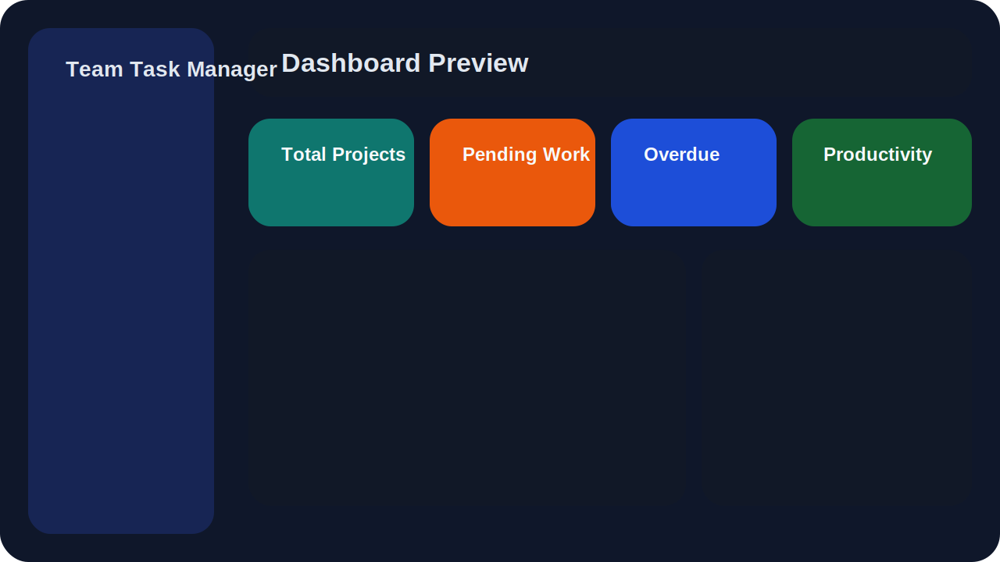
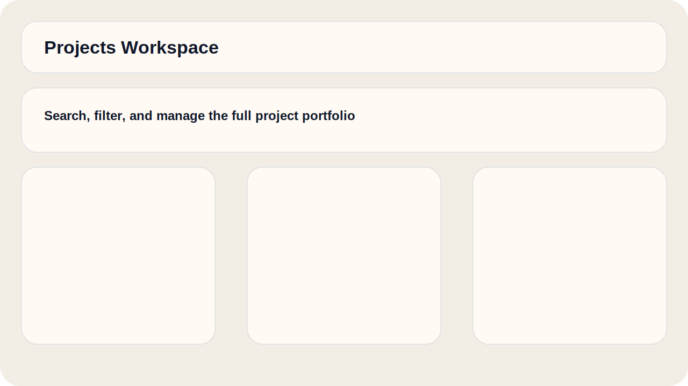
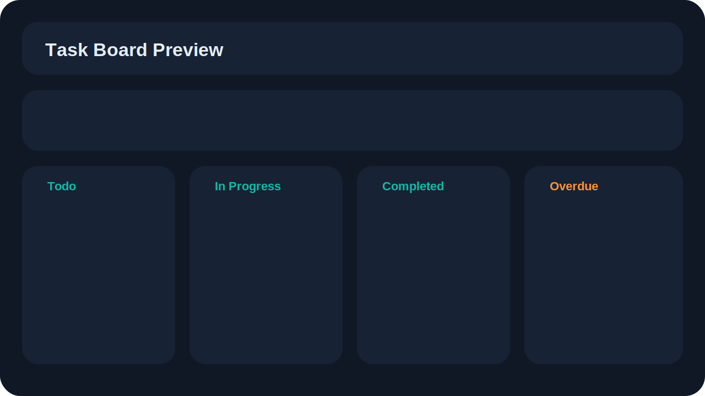

# Team Task Manager

Production-grade full-stack team execution platform with secure authentication, RBAC, project and task workflows, realtime notifications, dashboard analytics, Docker support, and deployment-ready documentation.

## Screenshots





## Features

- JWT access tokens with rotating refresh tokens stored in HTTP-only cookies
- Secure signup, login, logout, forgot-password, and reset-password flows
- Role-based permissions for `ADMIN` and `MEMBER`
- Project CRUD, member management, deadlines, status tracking, and progress calculation
- Task CRUD, assignment, comments, attachments, activity logging, filtering, sorting, pagination, kanban, and calendar view
- Realtime notification invalidation via Socket.io
- Dashboard analytics with completion trends, status mix, priority mix, and user performance
- Responsive React UI with protected routes, dark/light mode, loading states, and polished portfolio-ready layouts
- MongoDB + Mongoose backend with Zod validation, modular services, and production-oriented error handling
- Docker, Render, Vercel, and Netlify deployment support

## Tech Stack

### Frontend

- React 18 + Vite
- Tailwind CSS
- React Router
- Axios
- TanStack Query
- Redux Toolkit
- Framer Motion
- Recharts
- React Hook Form + Zod

### Backend

- Node.js
- Express.js
- MongoDB
- Mongoose
- JWT
- bcryptjs
- Socket.io

### Tooling

- ESLint
- Prettier
- Husky
- Jest
- Supertest
- Docker / Docker Compose

## Project Structure

```text
team-task-manager/
├── backend/
│   └── src/
│       ├── config/
│       ├── controllers/
│       ├── docs/
│       ├── jobs/
│       ├── middleware/
│       ├── models/
│       ├── routes/
│       ├── scripts/
│       ├── services/
│       ├── tests/
│       ├── utils/
│       └── validators/
├── docs/
├── frontend/
│   └── src/
│       ├── components/
│       ├── context/
│       ├── hooks/
│       ├── layouts/
│       ├── pages/
│       ├── redux/
│       ├── routes/
│       ├── services/
│       ├── styles/
│       └── utils/
├── docker-compose.yml
└── render.yaml
```

## Quick Start

### 1. Install dependencies

```bash
npm install
npm install --prefix backend
npm install --prefix frontend
```

### 2. Configure environment variables

```bash
cp backend/.env.example backend/.env
cp frontend/.env.example frontend/.env
```

Set the backend values:

- `MONGODB_URI`
- `MONGODB_DB_NAME`
- `JWT_ACCESS_SECRET`
- `JWT_REFRESH_SECRET`
- `CLIENT_URL`
- `CORS_ORIGIN`

### 3. Start MongoDB with Docker

```bash
docker compose up -d mongo
```

### 4. Seed demo data

```bash
npm run seed --prefix backend
```

### 5. Start frontend and backend

```bash
npm run dev
```

Frontend: `http://localhost:5173`  
Backend: `http://localhost:5000`  
Health: `http://localhost:5000/health`

## Sample Credentials

- Admin: `admin@teamtaskmanager.dev` / `Admin@12345`
- Member: `member@teamtaskmanager.dev` / `Member@12345`

## Environment Variables

### Backend

| Variable | Purpose |
| --- | --- |
| `MONGODB_URI` | MongoDB connection string |
| `MONGODB_DB_NAME` | Database name used by Mongoose |
| `CLIENT_URL` | Frontend origin for links and sockets |
| `CORS_ORIGIN` | Allowed frontend origins |
| `JWT_ACCESS_SECRET` | Access token signing secret |
| `JWT_REFRESH_SECRET` | Refresh token signing secret |
| `JWT_ACCESS_EXPIRES_IN` | Access token lifetime |
| `JWT_REFRESH_EXPIRES_IN` | Refresh token lifetime |
| `REFRESH_COOKIE_NAME` | Refresh cookie key |
| `SMTP_*` | Password reset email transport |
| `RESET_PASSWORD_URL` | Frontend reset route |
| `UPLOAD_DIR` | Attachment storage path |

### Frontend

| Variable | Purpose |
| --- | --- |
| `VITE_API_URL` | Backend API base URL |
| `VITE_SOCKET_URL` | Socket.io server origin |

## REST API Routes

### Auth

- `POST /api/auth/register`
- `POST /api/auth/login`
- `POST /api/auth/logout`
- `POST /api/auth/refresh`
- `POST /api/auth/forgot-password`
- `POST /api/auth/reset-password`

### Users

- `GET /api/users`
- `GET /api/users/:id`
- `PUT /api/users/:id`
- `DELETE /api/users/:id`

### Projects

- `POST /api/projects`
- `GET /api/projects`
- `GET /api/projects/:id`
- `PUT /api/projects/:id`
- `DELETE /api/projects/:id`
- `POST /api/projects/:id/members`
- `DELETE /api/projects/:id/members/:userId`

### Tasks

- `POST /api/tasks`
- `GET /api/tasks`
- `GET /api/tasks/:id`
- `PUT /api/tasks/:id`
- `DELETE /api/tasks/:id`
- `POST /api/tasks/:id/attachments`

### Comments and analytics

- `POST /api/comments`
- `GET /api/comments/:taskId`
- `GET /api/dashboard/summary`
- `GET /api/notifications`
- `PATCH /api/notifications/:id/read`

## Docker

### Run the full stack

```bash
docker compose up --build
```

This boots:

- MongoDB on `localhost:27017`
- Backend API on `localhost:5000`
- Frontend on `localhost:3000`

## Deployment

### Suggested targets

- Frontend: Vercel or Netlify
- Backend: Render or Railway
- Database: MongoDB Atlas

### Included deployment assets

- `frontend/vercel.json`
- `frontend/netlify.toml`
- `render.yaml`
- `frontend/Dockerfile`
- `backend/Dockerfile`
- `docker-compose.yml`

Deployment links are placeholders because this environment does not have your cloud credentials attached:

- Frontend: `https://<your-frontend-domain>`
- Backend: `https://<your-backend-domain>`
- API docs: `https://<your-backend-domain>/api/docs/openapi.yaml`

## Testing

```bash
npm run test --prefix backend
```

Validated coverage includes:

- Auth validator unit tests
- Token service unit tests
- Public route integration tests with Supertest

## Documentation Index

- [Setup Guide](./docs/setup-guide.md)
- [Deployment Guide](./docs/deployment-guide.md)
- [API Reference](./docs/api-reference.md)
- [Architecture Diagram](./docs/architecture.md)
- [ER Diagram](./docs/er-diagram.md)
- [Database Schema Explanation](./docs/database-schema.md)

## Notes

- Password reset email delivery logs to the console when SMTP is not configured.
- File uploads are stored locally under `backend/src/uploads` by default.
- Realtime UI invalidation is wired through Socket.io notification events.
- The backend is now MongoDB-native; use your Atlas connection string in `backend/.env` for production or live local testing against Atlas.
