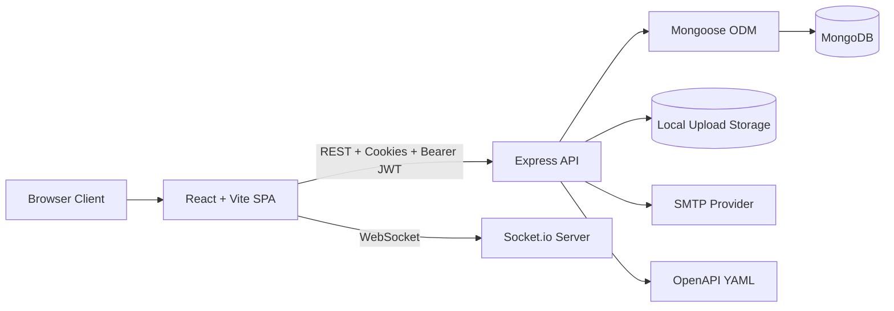
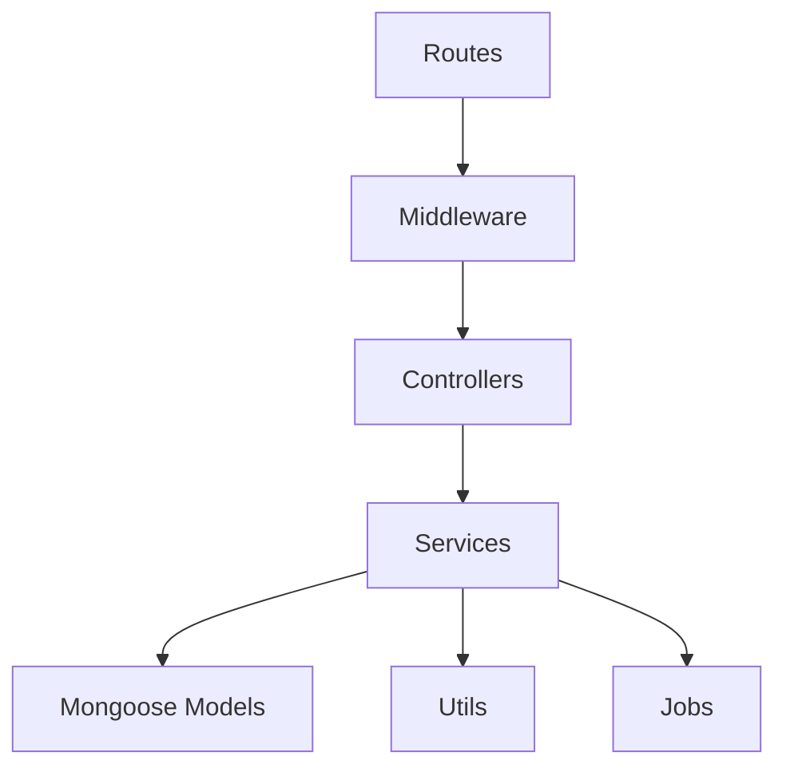
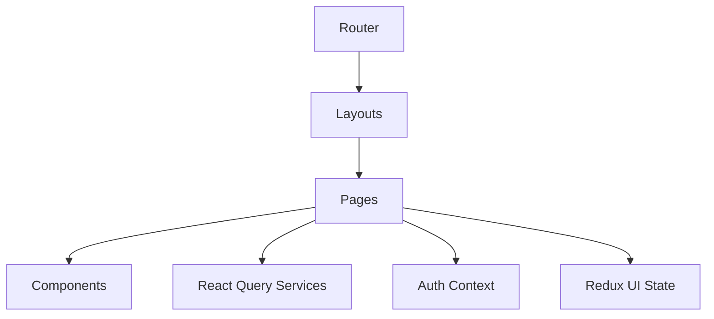

# Architecture Diagram

## System Overview

## Backend Layers

## Frontend Layers

## Design Notes

- Authentication uses short-lived access tokens and HTTP-only refresh cookies.
- MongoDB stores the domain model, with embedded task comments and attachments plus referenced users/projects.
- Socket.io is used for realtime invalidation of dashboard and task views when notifications are emitted.
- Validation is centralized with Zod on the backend and form-level schema validation on the frontend.
