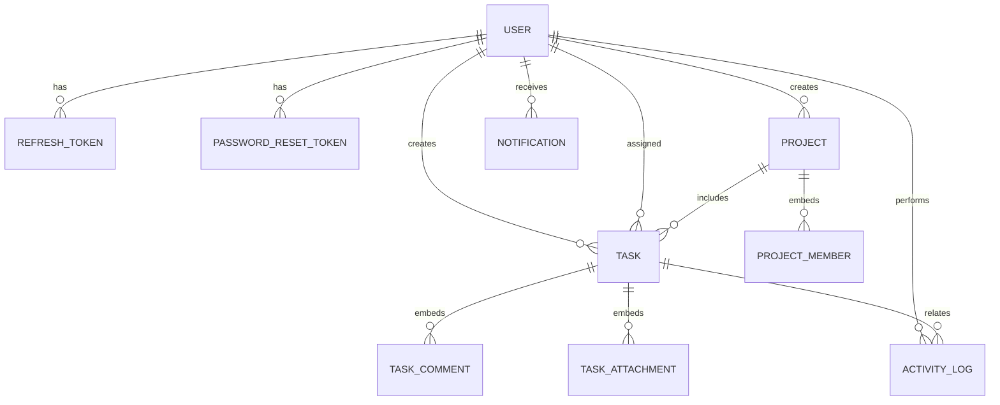

# ER Diagram

```mermaid
erDiagram
  USER ||--o{ REFRESH_TOKEN : has
  USER ||--o{ PASSWORD_RESET_TOKEN : has
  USER ||--o{ PROJECT : creates
  USER ||--o{ TASK : creates
  USER ||--o{ TASK : assigned
  USER ||--o{ NOTIFICATION : receives
  USER ||--o{ ACTIVITY_LOG : performs

  PROJECT ||--o{ TASK : includes
  PROJECT ||--o{ PROJECT_MEMBER : embeds

  TASK ||--o{ TASK_COMMENT : embeds
  TASK ||--o{ TASK_ATTACHMENT : embeds
  TASK ||--o{ ACTIVITY_LOG : relates
```
